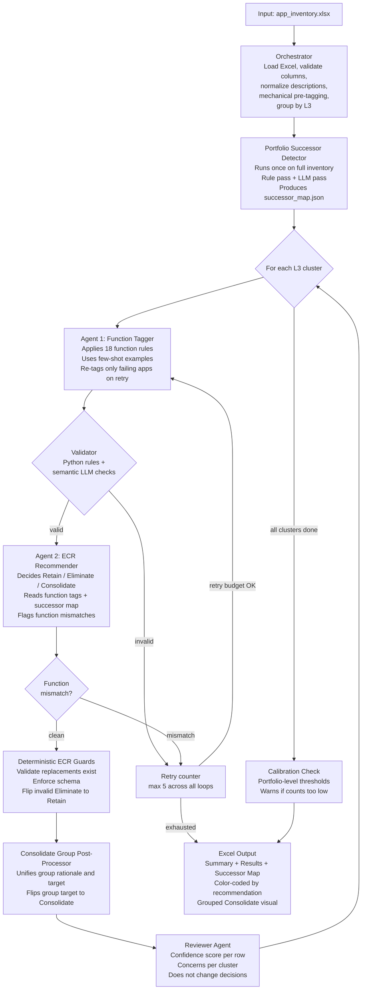
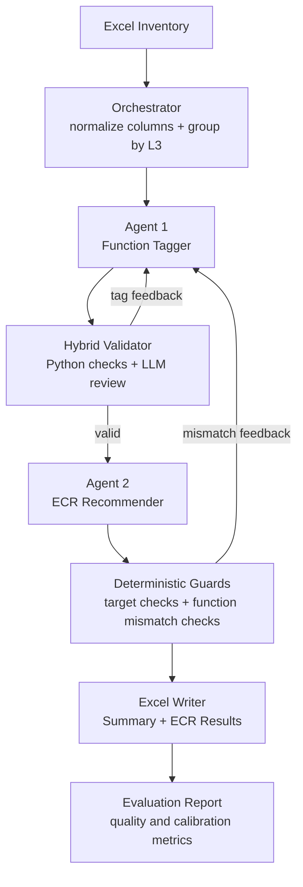

# Application Rationalization GenAI Agent

A production-style GenAI workflow for enterprise application rationalization. The system reads an application inventory workbook, groups apps by L3 business capability, assigns Function tags, and produces ECR recommendations: `Retain`, `Eliminate`, or `Consolidate`.

The project is built to show practical AI engineering: LangGraph agents, OpenAI-compatible LLM calls, prompt design, structured response handling, deterministic validation, evaluation reporting, a FastAPI service layer, Docker packaging, and CI.

## Business Problem

Large enterprises often maintain thousands of application records across CMDBs, spreadsheets, and portfolio tools. Rationalization teams manually inspect app descriptions and decide whether each app should be retained, eliminated, or consolidated. This project automates that analysis while keeping human-readable rationale and review guardrails.

## What It Produces

The output is an Excel workbook with:

- `Summary`: run timestamp, total apps, recommendation counts, L3 counts, retry-cap clusters, and warning rows.
- `ECR Results`: one row per app with Function, Recommendation, Rationale, App to be Retained, and Capability Loss if Eliminated.

Public synthetic examples are included:

- `sample_data/app_inventory_demo.xlsx`
- `sample_output/ecr_results_demo.xlsx`
- `sample_output/evaluation_report_demo.md`

## Tech Stack

| Area | Technology |
| --- | --- |
| Language | Python 3.11+ |
| Agent orchestration | LangGraph, LangChain |
| LLM integration | OpenAI-compatible Chat Completions endpoint |
| API | FastAPI |
| Schema validation | Pydantic |
| Data processing | pandas, openpyxl |
| Testing | pytest-compatible hardening tests |
| Deployment readiness | Docker, GitHub Actions |

The stack is intentionally focused. It does not include unrelated model training, Kubernetes, Databricks, or web search because the core use case is reliable LLM-assisted decision automation over structured enterprise inventory data.

## Architecture


## Architecture



The graph has a shared retry budget of five loops per L3 cluster. Agent 2 does not directly edit Function tags. If it finds a Function mismatch in an Eliminate or Consolidate group, the graph routes back to Agent 1 with feedback.

See `docs/ARCHITECTURE.md` for the full system layout, LangGraph workflow, and data/output sequence diagrams.

## Quick Start

```powershell
python -m venv .venv
.\.venv\Scripts\python.exe -m pip install -r requirements.txt
Copy-Item .env.example .env
```

Edit `.env`:

```env
OPENAI_BASE_URL=https://your-openai-compatible-gateway/v1
OPENAI_API_KEY=replace-with-your-key
OPENAI_MODEL=gpt-5.1
VALIDATOR_MODEL=gpt-5.1

INPUT_FILE=input/app_inventory.xlsx
INPUT_SHEET=Sheet1
OUTPUT_DIR=output
LOG_DIR=logs
ENABLE_WEB_SEARCH=false
```

Run the CLI workflow:

```powershell
.\.venv\Scripts\python.exe -m src.orchestrator
```

Run one L3 cluster:

```powershell
.\.venv\Scripts\python.exe -m src.orchestrator "Data Integration"
```

## Demo Without Client Data

Generate synthetic demo input and a reference output workbook:

```powershell
.\.venv\Scripts\python.exe scripts\create_demo_artifacts.py
```

Evaluate the demo output:

```powershell
.\.venv\Scripts\python.exe scripts\evaluate_output.py sample_output\ecr_results_demo.xlsx --out sample_output\evaluation_report_demo.md
```

To run the real LLM workflow on the demo input, set:

```env
INPUT_FILE=sample_data/app_inventory_demo.xlsx
```

Then run:

```powershell
.\.venv\Scripts\python.exe -m src.orchestrator
```

## REST API

Start the API:

```powershell
.\.venv\Scripts\uvicorn.exe src.api:app --reload
```

Open:

```text
http://127.0.0.1:8000/docs
```

Key endpoints:

- `GET /health`
- `POST /runs`
- `GET /outputs/{filename}`

## Input Workbook

Required logical columns after normalization:

- `Name`, or aliases such as `App Name`, `Application Name`, `System Name`
- `Vendor`, optional but recommended
- `Description`
- `L1`
- `L2`
- `L3`

Rows without an app name or L3 are ignored.

## Output Columns

1. App Name
2. Final L3
3. Function
4. Recommendation
5. Rationale
6. App to be Retained
7. Capability Loss if Eliminated

For clean replacements and Consolidate decisions, Capability Loss is normally blank. It is used as a warning flag only when elimination would lose a specific business capability that the retained app does not cover.

## Web Search

Web search is intentionally disabled for this version. The workflow uses portfolio context, Function tags, deterministic guardrails, and calibration patterns. No Tavily, SerpAPI, DuckDuckGo, or other third-party search SDK is required.

## Repository Hygiene

Do not commit:

- `.env`
- real client input workbooks
- generated client outputs
- logs
- `.venv`

The committed demo files are synthetic and safe for public GitHub use.

## More Docs

- `docs/APPROACH.md`
- `docs/ARCHITECTURE.md`
- `docs/API.md`
- `docs/DEMO_AND_DRY_RUN.md`
- `docs/OUTPUT_SCHEMA.md`
- `docs/OPERATING_NOTES.md`
- `docs/CV_PROJECT_FRAMING.md`
