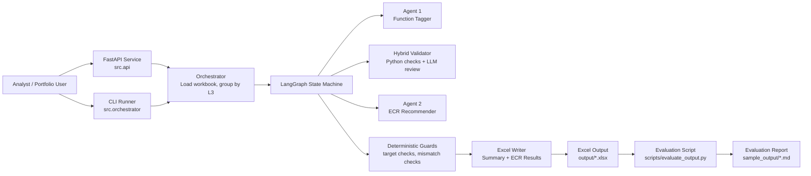
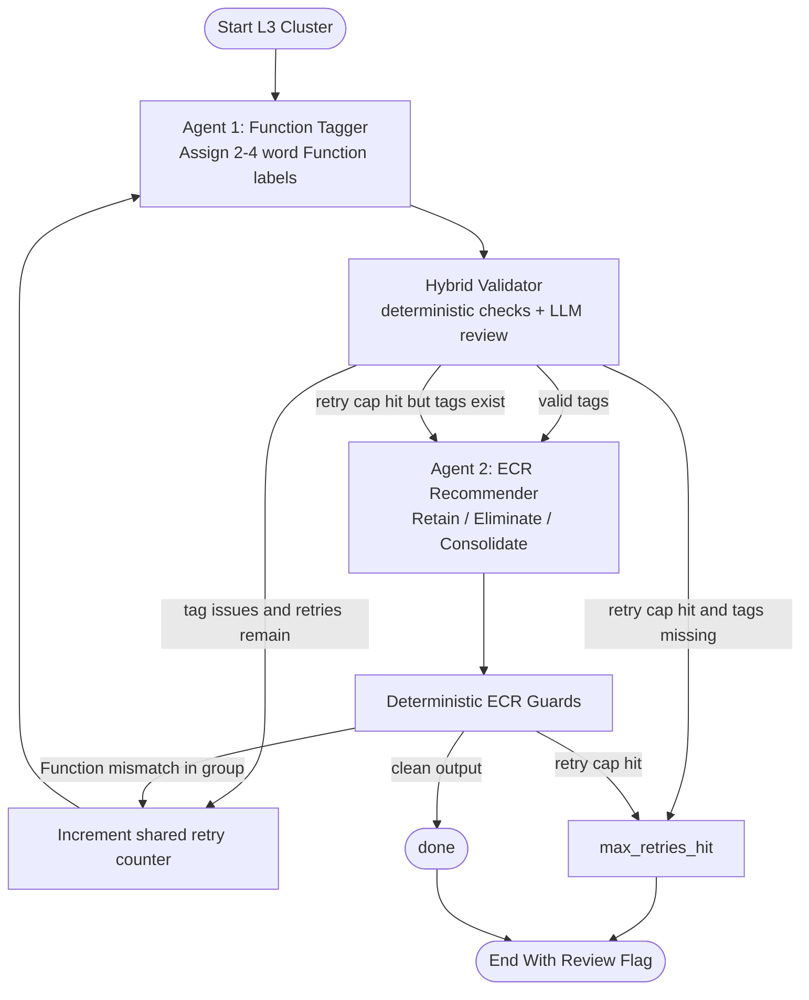
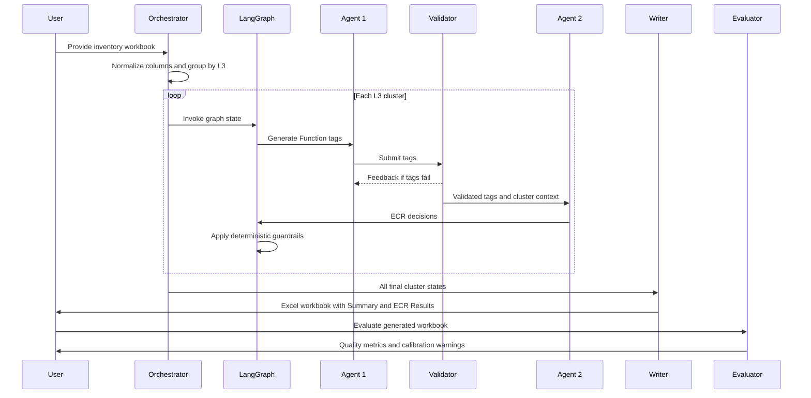

# Architecture Diagrams

This document shows the project layout and agent workflow using GitHub-rendered Mermaid diagrams.

## System Layout



## LangGraph Agent Flow



## Data And Output Flow



## Responsibility Split

| Component | Responsibility |
| --- | --- |
| `src/orchestrator.py` | Loads Excel, normalizes inventory columns, groups apps by L3, invokes graph, writes final workbook. |
| `src/graph.py` | Builds the LangGraph state machine and shared retry loop. |
| `src/agents/function_tagger.py` | Agent 1. Assigns business Function tags. |
| `src/validator.py` | Hybrid validation for Function tags. |
| `src/agents/ecr_recommender.py` | Agent 2. Produces ECR decisions and applies row-level normalization/repair. |
| `src/output_writer.py` | Writes formatted Excel output and run Summary sheet. |
| `src/api.py` | FastAPI wrapper for upload, run, and download workflows. |
| `scripts/evaluate_output.py` | Computes reliability and calibration metrics from generated Excel output. |

## Repository Layout

```text
.
├── src/
│   ├── agents/
│   │   ├── function_tagger.py
│   │   └── ecr_recommender.py
│   ├── api.py
│   ├── graph.py
│   ├── orchestrator.py
│   ├── output_writer.py
│   ├── schemas.py
│   └── validator.py
├── scripts/
│   ├── create_demo_artifacts.py
│   ├── evaluate_output.py
│   └── run_demo.ps1
├── sample_data/
│   └── app_inventory_demo.xlsx
├── sample_output/
│   ├── ecr_results_demo.xlsx
│   └── evaluation_report_demo.md
├── docs/
├── tests/
├── Dockerfile
└── requirements.txt
```
